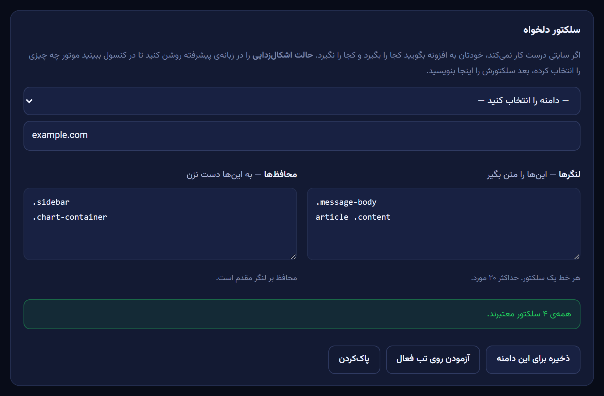

<div align="center">


# Persian Web Mixer

### راست‌چین‌ساز هوشمند فارسی، در همه‌ی وب

متن فارسی و عربی را در هر صفحه‌ای تشخیص می‌دهد و **فقط همان متن** را راست‌چین می‌کند.<br>
بلوک‌های کد، فرمول‌های ریاضی، آیکون‌ها، دکمه‌ها و چیدمان خود سایت دقیقاً همان‌طور که بودند می‌مانند.

[](manifest.json)
[](test/)
[](#privacy)
[](../../releases/latest)
[](LICENSE)

[**نصب**](#install) · [چه تفاوتی دارد](#why) · [قابلیت‌ها](#features) · [حریم خصوصی](#privacy) · [معماری](#how) · [English](README.md)

<picture>
  <source media="(prefers-color-scheme: dark)" srcset="docs/hero-dark.png">
  
</picture>

</div>

---

<a id="install"></a>

## نصب

حدود یک دقیقه وقت می‌گیرد. هیچ گام ساخت (build)، هیچ وابستگی و هیچ ورودی به حساب کاربری لازم نیست — جاوااسکریپت خالص است و فونت‌ها داخل خود افزونه‌اند.

**۱. فایل‌ها را بگیرید.** یا [آخرین نسخه](../../releases/latest) را دانلود و از حالت فشرده خارج کنید، یا کلون کنید:

```bash
git clone https://github.com/MineyBot/SmartAutoPersianRTL.git
```

پوشه را جایی بگذارید که بماند — `Documents`، نه `Downloads`. کرومیوم افزونه‌ی بسته‌بندی‌نشده را **از روی مسیرش** بار می‌کند، پس جابه‌جا یا حذف‌کردن پوشه بعداً یعنی حذف افزونه.

**۲. صفحه‌ی افزونه‌ها را باز کنید.** در نوار آدرس `chrome://extensions` را تایپ کنید — یا `edge://extensions`، `brave://extensions`، `opera://extensions`. لینک اینجا کار نمی‌کند؛ باید تایپ شود.

**۳. گزینه‌ی Developer mode را روشن کنید** (کلید گوشه‌ی بالا).

**۴. روی «Load unpacked» بزنید** و پوشه‌ای را انتخاب کنید که `manifest.json` **مستقیم داخلش** باشد. همین یک گام است که بیشتر اشتباه می‌شود: اگر برنامه‌ی حالت‌فشرده یک پوشه‌ی پوششی ساخته، اول بازش کنید و پوشه‌ی درونی را بدهید. اگر یک سطح بالاتر باشید، کرومیوم می‌گوید *«Manifest file is missing or unreadable»*.

تمام. صفحه‌ی تنظیمات چند ثانیه بعد خودش باز می‌شود.

### آزمودن این‌که کار می‌کند — ۶۰ ثانیه

۱. یک صفحه‌ی فارسی باز کنید — [fa.wikipedia.org](https://fa.wikipedia.org) گزینه‌ی خوبی است. پاراگراف‌ها باید راست‌چین بنشینند.<br>
۲. روی آیکن نوار ابزار بزنید. پاپ‌آپ باید نام سایت فعلی و شماری مثل `۴۸ بلوک · ۱ ریشه · ۱۲ م‌ث` را نشان بدهد.<br>
۳. صفحه‌ای با کد در آن باز کنید، مثلاً یک پرسش فارسی در Stack Overflow. **کد باید چپ‌چین بماند.** این کل هدف افزونه است — اگر کد آینه شد یعنی چیزی خراب است، لطفاً [گزارش بدهید](../../issues).

یک کار که ارزش دارد یک‌بار انجام شود: روی آیکن راست‌کلیک کنید و **Pin** بزنید تا کلید همیشه یک کلیک دور باشد.

### دو مورد اختیاری

**فایل‌های محلی.** برای این‌که روی صفحه‌های `file:///…` هم کار کند، در `chrome://extensions` روی **Details** افزونه بزنید و **Allow access to file URLs** را روشن کنید. پیش‌فرض خاموش است — انتخاب کرومیوم است، نه ما. (آزمودم: با دادن اجازه درست کار می‌کند.)

**میان‌برها.** `Alt`+`Shift`+`R` سایت فعلی را روشن/خاموش می‌کند، `Alt`+`Shift`+`E` کلید اصلی است، `Alt`+`Shift`+`P` صفحه را دوباره می‌پویَد. در `chrome://extensions/shortcuts` قابل تغییرند.

### به‌روز نگه‌داشتن

```bash
git pull
```

بعد دکمه‌ی ⟳ **reload** روی کارت افزونه را بزنید. تنظیماتت سر جایش می‌ماند — حالت، آستانه، قواعد هر سایت و سلکتورهای دلخواه همه از بارگذاری مجدد جان سالم به در می‌برند (آزموده شده، نه فرض). اگر از zip نصب کرده‌ای، محتوای پوشه را عوض کن و همان دکمه را بزن.

### اگر چیزی درست نبود

| نشانه | علت و راه‌حل |
|---|---|
| *«Manifest file is missing or unreadable»* | پوشه‌ی والد را انتخاب کرده‌ای. همان پوشه‌ای را بده که `manifest.json` داخلش است. |
| روی صفحه‌ای که از قبل باز بود هیچ اتفاقی نمی‌افتد | اسکریپت محتوا فقط هنگام بارگذاری وصل می‌شود. تب را دوباره بار کن، یا از تنظیمات → پیشرفته → **تزریق به تب‌های باز** استفاده کن. |
| همان دکمه می‌گوید «۰ تب فعال شد» | خرابی نیست — یعنی همه‌ی تب‌های باز از قبل افزونه را داشتند و از آن‌ها رد می‌شود. |
| پاپ‌آپ می‌گوید «صفحه‌ی داخلی» | روی `chrome://`، فروشگاه افزونه یا نمایشگر PDF هستی. هیچ افزونه‌ای به این‌ها دسترسی ندارد؛ به یک صفحه‌ی معمولی برو. |
| افزونه پس از راه‌اندازی مجدد ناپدید شد | پوشه جابه‌جا، تغییر نام یا حذف شده. افزونه‌ی بسته‌بندی‌نشده به مسیرش بند است — برش گردان یا دوباره بارش کن. |
| سایتی چیز اشتباهی را راست‌چین می‌کند | تنظیمات → پیشرفته → **حالت اشکال‌زدایی** را روشن کن؛ دور هر بلوکی که موتور دست زده کادر رنگی می‌آید. بعد یا خودت با [سلکتور دلخواه](#custom-selectors) درستش کن یا با همان تصویر گزارش بده. |

> کروم، اِج، بریو، اوپرا، ویوالدی — هر Chromium نسخه‌ی **۱۱۱ یا بالاتر**. فایرفاکس نه: API افزونه‌اش آن‌قدر متفاوت است که به پورت جداگانه نیاز دارد.

---

<a id="why"></a>

## مشکل رایج افزونه‌های راست‌چین‌ساز

روش رایج یک قاعده است: *اگر متن حرف فارسی دارد، راست‌چینش کن.* یک قاعده، و چهار خرابی که در دقیقه‌ی اول به آن‌ها برمی‌خورید:

| ورودی | قاعده‌ی ساده چه می‌کند | رفتار درست چیست |
|---|---|---|
| `The word سلام means hello in Persian` | کل پاراگراف را می‌چرخاند | رهایش کن — جمله انگلیسی است |
| `۱۲۳۴۵` | راست‌چینش می‌کند | ارقام **خنثی**‌اند؛ دست نزن |
| `def sort(a):  # مرتب‌سازی` | کدت را آینه می‌کند | کد همیشه چپ‌به‌راست است |
| دکمه‌ای با برچسب `ذخیره` | برچسب به یک لبه می‌پرد | جهت را درست کن، تراز را نگه دار |

این افزونه به‌جای آن، **نویسه‌های جهت‌دار قوی** را همان‌طور که الگوریتم دوجهته‌ی یونیکد می‌شمارد، می‌شمارد. ارقام (لاتین، عربی و فارسی)، نقطه‌گذاری، ایموجی و نیم‌فاصله خنثی‌اند و رأی نمی‌دهند. بعد تصمیم را برای هر بلوک جدا می‌گیرد، نه برای کل صفحه.

### سه حالت تشخیص

| حالت | قاعده | مناسب برای |
|---|---|---|
| **هوشمند** — پیش‌فرض | حروف فارسی ÷ همه‌ی حروف ≥ آستانه (۳۰٪) | محتوای مخلوط فارسی/انگلیسی: چت، مستندات، بازبینی کد |
| **خودکار** | جهت اولین حرف قوی | رفتار استاندارد یونیکد |
| **سخت‌گیر** | هر حرف فارسی یعنی راست‌چین | سایت‌های تماماً فارسی، وقتی صفر خطا می‌خواهید |

آستانه یک اسلایدر است. و اگر هیچ‌وقت مطمئن نبودی چرا پاراگرافی چرخید یا نچرخید، زبانه‌ی **آزمایشگاه** تصمیم واقعی موتور را نشان می‌دهد — شمارش حروف، نسبت، اولین نویسه‌ی قوی — برای هر متنی که بنویسی:

<div align="center"></div>

---

<a id="features"></a>

## قابلیت‌ها

### ۲۷ پروفایل سایت

یک افزونه‌ی عمومی هر عنصری را که متن در آن باشد می‌گیرد — که اغلب یک `<span>` سه سطح عمیق‌تر است، پس نصف جمله می‌چرخد و نصف دیگر نه. این یکی می‌داند «حباب پیام» در هر سایت واقعاً کدام است، و کدام بخش‌ها را هرگز نباید دست بزند.

**چت‌بات‌های هوش مصنوعی** — ChatGPT · Claude · Gemini · Google AI Studio · DeepSeek · Grok · Perplexity · Microsoft Copilot · Le Chat · NotebookLM · Poe · Kimi · Qwen · Z.ai · OpenRouter

**بقیه‌ی وب** — GitHub · GitLab · ویکی‌پدیا · Stack Overflow · Reddit · YouTube · X · Discord · تلگرام وب · واتساپ وب · Notion · Medium / Dev.to / Substack / ویرگول

سایت‌های بدون پروفایل به یک پروفایل عمومی می‌افتند که خودش کار می‌کند — افزونه محدود به این فهرست نیست. افزودن پروفایل تازه حدود ۸ خط تنظیمات است؛ [CONTRIBUTING.md](CONTRIBUTING.md#adding-a-site-profile) را ببین.

### Shadow DOM، از جمله ریشه‌های بسته

Angular Material، یوتیوب و ردیت درون Shadow DOM رندر می‌شوند و بخشی از آن `mode: 'closed'` است — کاملاً نامرئی برای یک content script معمولی، و همین دلیلِ آن است که متن فارسی درون آن اجزا هیچ‌وقت درست نمی‌شود. یک هوک در دنیای اصلی صفحه هنگام `document_start` آن‌ها را باز می‌کند و ریشه‌های تازه را با رویداد اعلام می‌کند، پس هیچ حلقه‌ی پیمایش دوره‌ای CPU نمی‌سوزاند.

### فیلدهای ورودی که درست رفتار می‌کنند

فیلدهای متنی `unicode-bidi: plaintext` و `dir="auto"` می‌گیرند، که تصمیم را **خط‌به‌خط** به خود مرورگر می‌سپارد. فارسی بنویس، راست‌چین می‌شود. خط بعد را انگلیسی شروع کن، چپ‌چین می‌شود. هیچ جاوااسکریپتی روی ضربه‌های کلیدت اجرا نمی‌شود.

### تایپوگرافی در اختیار تو

ارتفاع خط، فاصله‌ی حروف و کلمات و پاراگراف، هم‌ترازی دوطرفه، تودرتویی لیست، سمت خط نقل‌قول، آینه‌سازی جدول. چهار [وزیرمتن](https://github.com/rastikerdar/vazirmatn) درون‌ساخته (متغیر، ارقام فارسی، فقط‌فارسی، نقطه‌گرد)، فونت دلخواه خودت با آپلود، و اندازه‌ی ۷۰ تا ۱۶۰ درصد.

<div align="center">
 &nbsp;&nbsp; 
</div>

### کنترل به‌ازای هر سایت

هر دامنه را جدا روشن یا خاموش کن، یا حالت و فونت متفاوتی به آن بده. سه دامنه‌ی فعالیت پیش‌فرض را تعیین می‌کند: همه‌ی سایت‌ها، فقط سایت‌های شناخته‌شده، یا فقط چت‌بات‌ها.

<a id="custom-selectors"></a>

### سلکتور دلخواه — هر سایتی را یادش بده

۲۷ پروفایل، سایت‌هایی را می‌پوشانند که بیشتر استفاده می‌شوند؛ ولی وب از هر فهرستی بزرگ‌تر است. در تنظیمات → سایت‌ها می‌توانی برای هر دامنه سلکتور خودت را اضافه کنی:

| فیلد | معنی |
|---|---|
| **لنگرها** | این عنصرها را بلوک متن بگیر — وقتی سایتی پیام‌ها را در `<div>`ی می‌پیچد که فهرست عمومی به آن نمی‌رسد |
| **محافظ‌ها** | به این‌ها دست نزن — برای نمودار، نمایشگر کد اختصاصی، فونت آیکن |

اول حالت اشکال‌زدایی را روشن کن؛ موتور دور هرچه انتخاب کرده کادر می‌کشد، پس کلاس را از خود صفحه می‌خوانی و اینجا می‌گذاری. محافظ بر لنگر مقدم است، سلکتور نامعتبر پیش از ذخیره رد می‌شود (و گزارش زنده می‌گوید کدام خط ایراد داشت)، و **آزمودن روی تب فعال** می‌شمارد هر سلکتور واقعاً چند عنصر را می‌گیرد. تغییرها بی‌درنگ روی صفحه‌های باز اعمال می‌شوند — بدون بارگذاری مجدد.

<div align="center"></div>

### تنظیماتی که همراهت می‌آید

تنظیمات در `storage.sync` ذخیره می‌شوند، پس هرچه روی یک دستگاه تنظیم کنی روی هر مرورگر دیگری که با همان حساب وارد شده باشد ظاهر می‌شود. فونت آپلودی محلی می‌ماند — حدود ۱۴۵ کیلوبایت است و سهمیه‌ی sync برای هر آیتم ۸ کیلوبایت. اگر همگام‌سازی در دسترس نباشد (وارد حساب نشده‌ای، سهمیه پر است) بی‌صدا به ذخیره‌سازی محلی برمی‌گردد تا تنظیماتت گم نشود، و صفحه‌ی تنظیمات می‌گوید در کدام وضعیتی.

### میان‌برها و دسترسی سریع

| میان‌بر | کار |
|---|---|
| <kbd>Alt</kbd> <kbd>Shift</kbd> <kbd>R</kbd> | روشن/خاموش سایت فعلی |
| <kbd>Alt</kbd> <kbd>Shift</kbd> <kbd>E</kbd> | کلید اصلی |
| <kbd>Alt</kbd> <kbd>Shift</kbd> <kbd>P</kbd> | پویش دوباره‌ی صفحه |

در `chrome://extensions/shortcuts` قابل تغییرند. منوی راست‌کلیک هم دارد، و آیکن نوار ابزار هر جا افزونه خاموش باشد خاکستری می‌شود.

---

<a id="privacy"></a>

## حریم خصوصی و مجوزها

- **صفر درخواست شبکه.** فونت‌ها داخل خود افزونه‌اند؛ در زمان اجرا هیچ چیزی، هیچ‌وقت، دریافت نمی‌شود.
- **هیچ داده‌ای از مرورگرت بیرون نمی‌رود.** بدون تله‌متری، بدون آنالیتیکس، بدون خواندن یا ثبت محتوای صفحه.
- **امنیت سایت دست‌نخورده می‌ماند.** بدون `declarativeNetRequest`، بدون بازنویسی هدر. (توضیح در [تصمیم سوم](#fonts).)
- تنها چیزی که ذخیره می‌شود تنظیمات خودت است — در `storage.sync` تا همراه حساب مرورگرت بیاید، و فونت آپلودی در `storage.local` چون از سهمیه‌ی همگام‌سازی بزرگ‌تر است. در هر حال، از مرورگر تو بیرون نمی‌رود.

| مجوز | برای چه |
|---|---|
| `storage` | ذخیره‌ی تنظیمات تو |
| `scripting` | فعال‌کردن تب‌هایی که هنگام نصب یا به‌روزرسانی از قبل باز بودند |
| `contextMenus` | منوی راست‌کلیک |
| `<all_urls>` | خواندن متن صفحه‌ای که همین حالا در آن هستی |

---

<a id="how"></a>

## چطور کار می‌کند

```
src/core/            منطق خالص — بدون chrome.* و بدون DOM در زمان بارگذاری
  bidi.js            تشخیص جهت با شمارش نویسه‌های قوی
  sites.js           ۲۷ پروفایل سایت: لنگرها، نگهبان‌ها، سلکتور ورودی‌ها
  settings.js        طرح تنظیمات، اعتبارسنجی، مهاجرت v3→v5، تنظیمات هر دامنه
  css.js             تولید استایل + تزریق با Constructable Stylesheets
src/content/
  engine.js          پیمایش تدریجی DOM، نشانه‌گذاری، مدیریت Shadow DOM
  boot.js            راه‌اندازی، بارگذاری فونت، پیام‌ها
src/main-world/      هوک attachShadow (دنیای MAIN، هنگام document_start)
src/background/      سرویس‌ورکر: نشان آیکن، منوی راست‌کلیک، میان‌برها، تزریق
src/popup/           رابط پاپ‌آپ
src/options/         صفحه‌ی تنظیمات — ۶ زبانه + آزمایشگاه تشخیص
```

فایل‌های `core/` عمداً هیچ وابستگی ندارند، پس همان کد در content script، پاپ‌آپ، صفحه‌ی تنظیمات، سرویس‌ورکر **و** زیر Node در مجموعه‌ی آزمون اجرا می‌شود. به همین دلیل است که منطق تشخیص را می‌توان بدون هیچ مرورگری آزمود.

### چهار تصمیم معماری که ارزش توضیح دارند

#### ۱. نشانه‌گذاری با data attribute، نه کلاس CSS

موتور روی بلوک `data-pwm-dir="rtl"` می‌گذارد. یک نام کلاس با کلاس‌های خود سایت برخورد می‌کند و از پاک‌سازی ناقص جان سالم می‌برد؛ اما جاروی attribute (`querySelectorAll('[data-pwm-dir]')`) تضمین می‌کند صفحه در همان لحظه‌ای که خاموش کنی *دقیقاً* به حالت اصلی برگردد.

#### ۲. `text-align: start` نه `text-align: right`

با `start` و `direction: inherit` روی فرزندان، یک «جزیره»ی لاتین درون پاراگراف فارسی خودش درست تراز می‌شود. بعد ویژگی‌های منطقی (`padding-inline-start`، `border-inline-start`) لیست‌ها و نقل‌قول‌ها را مجانی و در هر دو جهت آینه می‌کنند.

<a id="fonts"></a>

#### ۳. فونت با `FontFace` + `ArrayBuffer`، نه `@font-face { src: url() }`

فونت به‌صورت بایت خوانده و به `document.fonts` سپرده می‌شود، که سیاست `font-src` صفحه را بی‌ربط می‌کند. افزونه‌هایی که فونت را با URL تزریق می‌کنند معمولاً روی سایت‌های سخت‌گیر نمی‌توانند بارش کنند، پس برای کار‌کردنش **هدر `Content-Security-Policy` سایت را حذف می‌کنند** — و بی‌صدا امنیت هر صفحه‌ای که بازدید می‌کنی را تضعیف می‌کنند. این افزونه هیچ هدر پاسخی را دست نمی‌زند و مجوز `declarativeNetRequest` کاملاً از manifest حذف شده است.

مزیت جانبی: فونتی که به `document.fonts` اضافه شود درون همه‌ی Shadow Root ها معتبر است، پس تزریق جداگانه لازم نیست.

#### ۴. پردازش تدریجی و برش‌بندی‌شده

فقط زیردرخت گره‌های تغییریافته در صف می‌رود. کار در برش‌های `budgetMs` اجرا می‌شود که بین دسته‌ها به حلقه‌ی رویداد باز می‌گردند، و خواندن DOM از نوشتن جدا شده تا layout thrashing رخ ندهد. زمان‌بندی عمداً از `requestIdleCallback` و `requestAnimationFrame` استفاده نمی‌کند: هر دو در تب پنهان، پنجره‌ی پوشیده و پنجره‌ی بی‌فوکوس متوقف می‌شوند و پردازش را برای همیشه معلق می‌گذارند.

**اندازه‌گیری‌شده:** ۲٬۰۰۰ پاراگراف در حدود ۵۵۰ میلی‌ثانیه، صفحه با نرخ فریم کامل.

---

## توسعه

```bash
npm install           # jsdom و puppeteer-core، فقط برای توسعه

npm test              # ۱۶۹ آزمون واحد — منطق + jsdom، بدون نیاز به مرورگر
npm run test:browser  # ۱۲۰ آزمون یکپارچه — افزونه‌ی واقعی را بار می‌کند
npm run pack          # → dist/persian-web-mixer-v4.1.0.zip
node tools/shots.js   # ساخت دوباره‌ی docs/*.png
```

**`test/run.js`** تشخیص جهت، تطبیق دامنه، اعتبارسنجی و محدودسازی تنظیمات، تولید CSS، نشانه‌گذاری DOM، Shadow DOM، پاک‌سازی کامل و یکپارچگی بسته را می‌سنجد — این‌که هر فونت درون‌ساخته WOFF2 معتبر باشد، هر آیکن PNG معتبر، و هر سلکتور پروفایل واقعاً کامپایل شود.

**`test/browser.js`** افزونه را واقعاً بار می‌کند و رفتار را می‌آزماید نه پیاده‌سازی را: تراز بصری از کادر `Range`، رندر فونت از عرض متن در canvas، ورودی واقعی صفحه‌کلید، محتوای استریمی، Shadow DOM (باز، بسته و تودرتو)، رفت‌وبرگشت پیام با سرویس‌ورکر، تغییر زنده‌ی تنظیمات، آینه‌سازی چیدمان، جابه‌جایی زبانه‌ها، و کارایی روی ۲٬۰۰۰ پاراگراف.

> **کروم از نسخه‌ی ۱۳۷ حذف `--load-extension` را آغاز کرد و در نسخه‌ی ۱۵۰ این سوئیچ کاملاً بی‌اثر است** — دیگر Puppeteer به‌هیچ‌وجه نمی‌تواند در کروم افزونه‌ی unpacked بار کند. پس مجموعه‌ی مرورگری به‌طور پیش‌فرض روی **اِج** اجرا می‌شود (همان موتور Chromium). با `CHROME_PATH` قابل تغییر است.

CI روی هر push آزمون‌های واحد را اجرا می‌کند. آزمون مرورگری به پنجره‌ی واقعی نیاز دارد، پس محلی می‌ماند.

---

## محدودیت‌های شناخته‌شده

صادقانه، کارهایی که این افزونه نمی‌کند:

- **فقط جهت متن، نه آینه‌سازی چیدمان.** آواتارها، نوار کنار و نوار ابزار همان‌جا می‌مانند که سایت گذاشته. آینه‌کردن کل چیدمان یک سایت بیشتر از آنکه درست کند خراب می‌کند، پس پیش‌فرض خاموش است (یک کلید آزمایشی در تنظیمات ← پیشرفته هست).
- **متن روی canvas و `<video>` دست‌نیافتنی است.** هر چیزی که کشیده می‌شود نه چیده — رندرر canvas گوگل داکس، زیرنویس سوخته در ویدیو — با هیچ افزونه‌ای قابل استایل‌دادن نیست.
- **صفحه‌ای که خودش `dir="rtl"` را درست گذاشته به چیزی نیاز ندارد** و افزونه رهایش می‌کند. این عمدی است، نه از قلم افتادن.
- **تب‌های بازِ پیش از نصب یک تکان لازم دارند.** تنظیمات ← پیشرفته ← *تزریق به تب‌های باز*، یا فقط رفرششان کن.

---

## مشارکت

گزارش باگ همراه با آدرس سایت و یک اسکرین‌شات، مفیدترین چیزی است که می‌توانی بفرستی. اگر سایتی عنصر اشتباه را می‌چرخاند، **حالت اشکال‌زدایی** را روشن کن (تنظیمات ← پیشرفته) — دور هر بلوکی که موتور دست زده کادر رنگی می‌افتد و معمولاً در یک نگاه مقصر را نشان می‌دهد.

افزودن پروفایل سایت، اجرای آزمون‌ها، و چند الگویی که باعث رد شدن PR می‌شوند، همه در [CONTRIBUTING.md](CONTRIBUTING.md) هستند.

---

## اعتبارها

فونت درون‌ساخته: [وزیرمتن](https://github.com/rastikerdar/vazirmatn) اثر صابر راستی‌کردار، با پروانه‌ی SIL Open Font License 1.1.

کد افزونه: MIT — [LICENSE](LICENSE) را ببین. تاریخ کامل تغییرات در [CHANGELOG.md](CHANGELOG.md).
