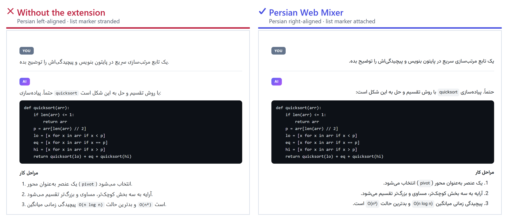

<div align="center">


# Persian Web Mixer · راست‌چین‌ساز هوشمند وب

**راست‌چین‌سازی دقیق متن فارسی در همه‌ی وب.**

افزونه‌ای برای مرورگرهای Chromium که متن فارسی/عربی را در هر صفحه‌ای تشخیص می‌دهد و **فقط همان بلوک‌ها** را راست‌چین می‌کند — بدون خراب‌کردن کد، فرمول ریاضی، آیکون‌ها یا چیدمان خود سایت.

[English README](README.md)

<picture>
  <source media="(prefers-color-scheme: dark)" srcset="docs/hero-dark.png">
  
</picture>

</div>

---

## مسئله چیست

بیشتر افزونه‌های راست‌چین‌ساز یک قاعده دارند: *اگر متن حرف فارسی دارد، راست‌چین کن.* همین یک قاعده چهار خرابی می‌سازد که در دقیقه‌ی اول استفاده به آن‌ها برمی‌خورید:

| ورودی | افزونه‌ی ساده | رفتار درست |
|---|---|---|
| `The word سلام means hello in Persian` | کل پاراگراف را می‌چرخاند | چپ‌چین می‌ماند — جمله انگلیسی است |
| `۱۲۳۴۵` | راست‌چینش می‌کند | ارقام **خنثی**‌اند، دست‌نخورده |
| `def sort(a): # مرتب‌سازی` | کد شما را آینه می‌کند | کد همیشه چپ‌چین |
| دکمه‌ای با برچسب `ذخیره` | برچسب به یک لبه می‌پرد | جهت بله، تراز نه |

این افزونه به‌جای آن، **نویسه‌های جهت‌دار قوی** را طبق الگوریتم دوجهته‌ی یونیکد می‌شمارد. ارقام (لاتین، عربی، فارسی)، نقطه‌گذاری، ایموجی و نیم‌فاصله خنثی‌اند و رأی نمی‌دهند.

## حالت‌های تشخیص

| حالت | قاعده | چه وقت |
|---|---|---|
| **هوشمند** (پیش‌فرض) | حروف فارسی ÷ همه‌ی حروف ≥ آستانه (۳۰٪) | محتوای مخلوط فارسی/انگلیسی — چت، مستندات، کد |
| **خودکار** | جهت از اولین حرف قوی | وقتی رفتار استاندارد یونیکد را می‌خواهید |
| **سخت‌گیر** | هر حرف فارسی ⇒ راست‌چین | سایت‌های تماماً فارسی، بدون هیچ خطا |

آستانه یک اسلایدر است، و زبانه‌ی **آزمایشگاه** در تنظیمات تصمیم موتور، شمارش حروف، نسبت و پیش‌نمایش زنده را برای هر متنی که بنویسید نشان می‌دهد.

<div align="center"></div>

---

## نصب

**از سورس:**

1. مخزن را دانلود یا کلون کنید.
2. `chrome://extensions` (یا `edge://extensions`) را باز کنید.
3. **Developer mode** را روشن کنید.
4. **Load unpacked** → پوشه‌ی پروژه را انتخاب کنید.

هیچ گام ساخت (build) لازم نیست؛ جاوااسکریپت خالص است و فونت‌ها داخل خود افزونه‌اند.

یا فایل `.zip` آماده را از [Releases](../../releases) بگیرید و روی صفحه‌ی افزونه‌ها بکشید.

---

## قابلیت‌ها

### ۲۷ پروفایل سایت

افزونه می‌داند «حباب پیام» در هر سایت کدام است، پس کل نوبت گفتگو را راست‌چین می‌کند نه یک `<span>` تصادفی درونی — و می‌داند چه بخشی را هرگز نباید دست بزند.

**چت‌بات‌های هوش مصنوعی:** ChatGPT · Claude · Gemini · Google AI Studio · DeepSeek · Grok · Perplexity · Microsoft Copilot · Le Chat · NotebookLM · Poe · Kimi · Qwen · Z.ai · OpenRouter

**وب معمولی:** GitHub · GitLab · ویکی‌پدیا · Stack Overflow · Reddit · YouTube · X/Twitter · Discord · تلگرام وب · واتساپ وب · Notion · Medium/Dev.to/ویرگول

سایت‌های ناشناس پروفایل عمومی می‌گیرند که خودش کار می‌کند — افزونه محدود به این فهرست نیست.

### Shadow DOM، از جمله ریشه‌های بسته

Angular Material، یوتیوب و ردیت درون Shadow DOM رندر می‌شوند و بعضی از `mode: 'closed'` استفاده می‌کنند که برای افزونه‌های معمولی نامرئی است. یک هوک در دنیای `MAIN` هنگام `document_start` آن‌ها را باز می‌کند و ریشه‌های تازه را با رویداد اطلاع می‌دهد — بدون پیمایش دوره‌ای.

### فیلدهای ورودی

ورودی‌ها `unicode-bidi: plaintext` و `dir="auto"` می‌گیرند، پس **خود مرورگر** جهت هر خط را تعیین می‌کند. فارسی بنویسید، راست‌چین می‌شود؛ خط بعد انگلیسی بنویسید، چپ‌چین. صفر جاوااسکریپت در هر ضربه‌ی کلید.

### تایپوگرافی

ارتفاع خط، فاصله‌ی حروف/کلمات/پاراگراف، هم‌ترازی دوطرفه، تودرتویی لیست، سمت خط نقل‌قول، آینه‌سازی جدول — به‌همراه ۴ وزیرمتن درون‌ساخته (متغیر، ارقام فارسی، فقط‌فارسی، نقطه‌گرد)، آپلود فونت دلخواه و اندازه‌ی ۷۰ تا ۱۶۰ درصد.

<div align="center">
 &nbsp; 
</div>

### کنترل به‌ازای سایت

هر دامنه را جدا روشن/خاموش کنید، یا برایش حالت و فونت متفاوت بدهید. سه دامنه‌ی فعالیت: همه‌ی سایت‌ها، فقط سایت‌های شناخته‌شده، یا فقط چت‌بات‌ها.

### میان‌برهای صفحه‌کلید

| میان‌بر | کار |
|---|---|
| <kbd>Alt</kbd>+<kbd>Shift</kbd>+<kbd>R</kbd> | روشن/خاموش سایت فعلی |
| <kbd>Alt</kbd>+<kbd>Shift</kbd>+<kbd>E</kbd> | کلید اصلی |
| <kbd>Alt</kbd>+<kbd>Shift</kbd>+<kbd>P</kbd> | پویش دوباره‌ی صفحه |

در `chrome://extensions/shortcuts` قابل تغییرند. منوی راست‌کلیک هم دارد، و آیکن نوار ابزار وقتی افزونه در سایت فعلی خاموش است خاکستری می‌شود.

---

## حریم خصوصی

- **صفر درخواست شبکه.** فونت‌ها همراه افزونه‌اند؛ هیچ چیز در زمان اجرا دریافت نمی‌شود.
- **هیچ داده‌ای از مرورگر بیرون نمی‌رود.** بدون تله‌متری، بدون آنالیتیکس، بدون خواندن محتوای صفحه.
- **امنیت سایت دست‌نخورده.** بدون `declarativeNetRequest`، بدون بازنویسی هدر — دلیلش پایین‌تر توضیح داده شده.
- تنها ذخیره‌سازی، تنظیمات خودتان در `storage.local` است.

مجوزهای درخواستی: `storage`، `scripting`، `contextMenus` و `<all_urls>` (لازم است چون افزونه باید متن هر صفحه‌ای را که در آن هستید بخواند).

---

## چطور کار می‌کند

```
src/core/          منطق خالص — بدون chrome.* و بدون DOM؛ در همه‌ی محیط‌ها و در تست‌های Node اجرا می‌شود
  bidi.js          تشخیص جهت با شمارش نویسه‌های قوی
  sites.js         ۲۷ پروفایل سایت: لنگرها، نگهبان‌ها، سلکتور ورودی‌ها
  settings.js      طرح تنظیمات، اعتبارسنجی، مهاجرت v3→v4، تنظیمات مؤثر هر دامنه
  css.js           تولید استایل + تزریق با Constructable Stylesheets
src/content/
  engine.js        پیمایش تدریجی DOM، نشانه‌گذاری، مدیریت Shadow DOM
  boot.js          راه‌اندازی، بارگذاری فونت، پیام‌ها
src/main-world/    هوک attachShadow (دنیای MAIN، document_start)
src/background/    سرویس‌ورکر: آیکن، منوی راست‌کلیک، میان‌برها، تزریق به تب‌ها
src/popup/         رابط پاپ‌آپ
src/options/       صفحه‌ی تنظیمات (۶ زبانه + آزمایشگاه تشخیص)
```

### چهار تصمیم معماری

**۱. نشانه‌گذاری با data attribute، نه کلاس CSS.**
موتور روی بلوک `data-pwm-dir="rtl"` می‌گذارد. کلاس با کلاس‌های خود سایت برخورد می‌کند و از پاک‌سازی ناقص جان سالم می‌برد؛ اما جاروی attribute (`querySelectorAll('[data-pwm-dir]')`) تضمین می‌کند صفحه هنگام خاموش‌کردن دقیقاً به حالت اصلی برگردد.

**۲. `text-align: start` به‌جای `text-align: right`.**
با `start` و `direction: inherit` روی فرزندان، یک «جزیره‌ی» لاتین درون پاراگراف فارسی خودش درست تراز می‌شود. بعد ویژگی‌های منطقی (`padding-inline-start`، `border-inline-start`) لیست‌ها و نقل‌قول‌ها را مجانی آینه می‌کنند.

**۳. فونت با `FontFace` + `ArrayBuffer`، نه `@font-face` با URL.**
فونت به‌صورت بایت خوانده و به `document.fonts` اضافه می‌شود، پس `font-src` در CSP سایت بی‌ربط است. افزونه‌هایی که فونت را با URL تزریق می‌کنند اغلب **هدر `Content-Security-Policy` سایت را حذف می‌کنند** — یک تضعیف امنیتی واقعی. این افزونه هیچ هدری را دست نمی‌زند و مجوز `declarativeNetRequest` کاملاً حذف شده. مزیت جانبی: فونت‌های اضافه‌شده به `document.fonts` درون همه‌ی Shadow Root ها هم معتبرند.

**۴. پردازش تدریجی و برش‌بندی‌شده.**
فقط زیردرخت گره‌های تغییریافته در صف می‌رود، کار به برش‌های `budgetMs` تقسیم می‌شود که بین‌شان به حلقه‌ی رویداد باز می‌گردد، و خواندن DOM از نوشتن جدا شده تا layout thrashing رخ ندهد. زمان‌بندی عمداً از `requestIdleCallback` و `requestAnimationFrame` استفاده نمی‌کند — هر دو در تب پنهان و پنجره‌ی بی‌فوکوس متوقف می‌شوند و پردازش را برای همیشه معلق می‌گذارند.

اندازه‌گیری‌شده: ۲۰۰۰ پاراگراف در حدود ۵۵۰ میلی‌ثانیه، صفحه با نرخ فریم کامل.

---

## توسعه

```bash
npm test              # ۱۲۲ آزمون واحد (منطق خالص + DOM با jsdom)
npm run test:browser  # ۸۸ آزمون یکپارچه در مرورگر واقعی با افزونه‌ی بارگذاری‌شده
npm run pack          # → dist/persian-web-mixer-v4.0.0.zip
node tools/shots.js   # ساخت دوباره‌ی docs/*.png
```

`test/run.js` تشخیص جهت، تطبیق دامنه، اعتبارسنجی و محدودسازی تنظیمات، تولید CSS، نشانه‌گذاری DOM، Shadow DOM، پاک‌سازی کامل و یکپارچگی بسته را می‌سنجد (فونت‌ها WOFF2 معتبر، آیکن‌ها PNG معتبر، همه‌ی سلکتورهای پروفایل‌ها قابل‌کامپایل).

`test/browser.js` افزونه‌ی واقعی را بار می‌کند و رفتار واقعی را می‌آزماید: تراز بصری با `Range`، رندر فونت با عرض متن در canvas، تایپ با صفحه‌کلید، محتوای استریمی، Shadow DOM (باز/بسته/تودرتو)، رفت‌وبرگشت پیام با سرویس‌ورکر، تغییر زنده‌ی تنظیمات، آینه‌سازی چیدمان و کارایی روی ۲۰۰۰ پاراگراف.

> نیازمند `jsdom` و `puppeteer-core`. اگر در `node_modules` نیستند، `NODE_PATH` را به محلشان بدهید.
>
> **کروم از نسخه‌ی ۱۳۷ شروع به حذف `--load-extension` کرد و در ۱۵۰ کاملاً بی‌اثر است** — پس puppeteer در کروم به‌هیچ‌وجه نمی‌تواند افزونه‌ی unpacked بار کند. آزمون مرورگری به‌طور پیش‌فرض **Edge** را اجرا می‌کند (همان موتور Chromium). با `CHROME_PATH` قابل تغییر است.

---

## نسخه‌ی ۳ → ۴

نسخه‌ی ۴ بازنویسی کامل است. نسخه‌ی قبل ۹۸۸ خط بود، این یکی حدود ۳٬۹۰۰ خط در `src/`.

| | نسخه ۳ | نسخه ۴ |
|---|---|---|
| تشخیص | هر حرف فارسی ⇒ راست‌چین | شمارش نویسه‌های قوی، ۳ حالت + آستانه |
| ارقام فارسی تنها | راست‌چین می‌شد (نادرست) | خنثی |
| پیمایش DOM | کل `document.body` در هر تغییر | فقط زیردرخت تغییریافته، برش‌بندی‌شده |
| نشانه | کلاس `.rtl-processed` | attribute `data-pwm-dir` |
| تراز | `text-align:right` روی همه‌ی فرزندان | `text-align:start` + `direction:inherit` |
| کنترل‌های UI | تراز دکمه‌ها خراب می‌شد | `rtl-ui`: فقط جهت |
| فونت | `@font-face` با data:URL | `FontFace` + `ArrayBuffer` |
| CSP سایت | **هدر را حذف می‌کرد** | دست‌نخورده؛ مجوز حذف شد |
| ورودی‌ها | JS در هر رویداد `input` | `unicode-bidi:plaintext` |
| Shadow DOM | پیمایش دوره‌ای همه‌ی عناصر | رویداد از هوک دنیای MAIN |
| سایت‌ها | ۵ نام در پاپ‌آپ (بدون منطق) | ۲۷ پروفایل با لنگر و نگهبان |
| تنظیمات | ۳ کلید | صفحه‌ی کامل، به‌ازای دامنه، برون‌بری |
| آزمون | — | ۱۲۲ واحد + ۸۸ مرورگری |

---

## اعتبارها

فونت درون‌ساخته: [وزیرمتن](https://github.com/rastikerdar/vazirmatn) اثر صابر راستی‌کردار (SIL OFL 1.1).

کد افزونه: MIT — [LICENSE](LICENSE).
