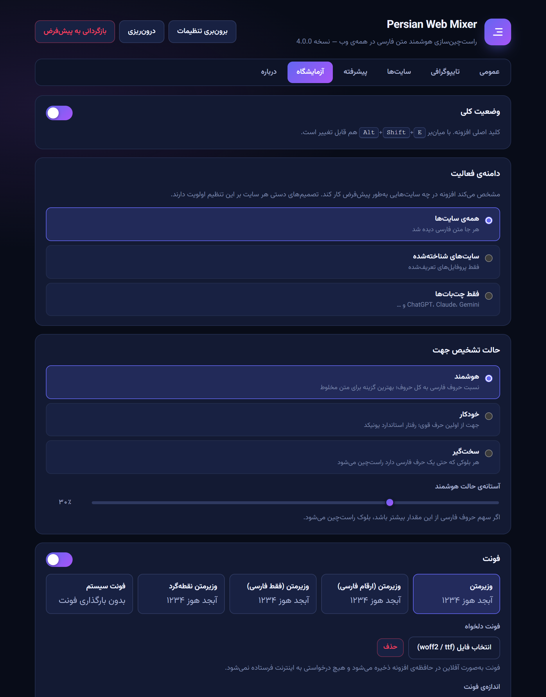
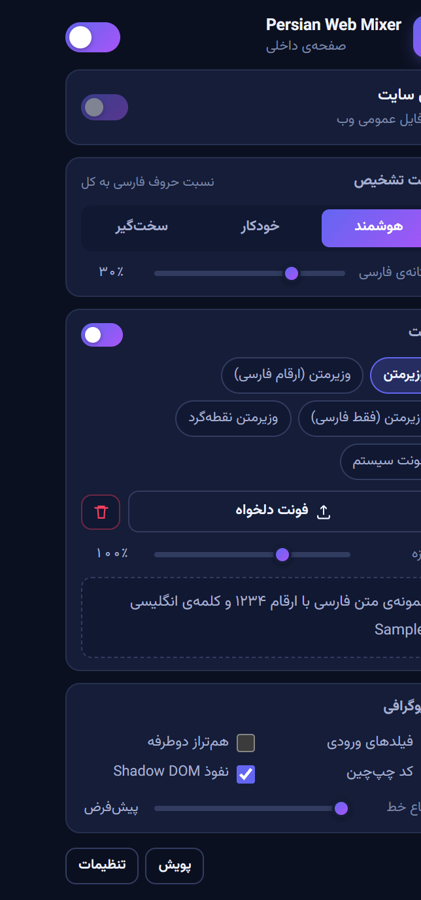
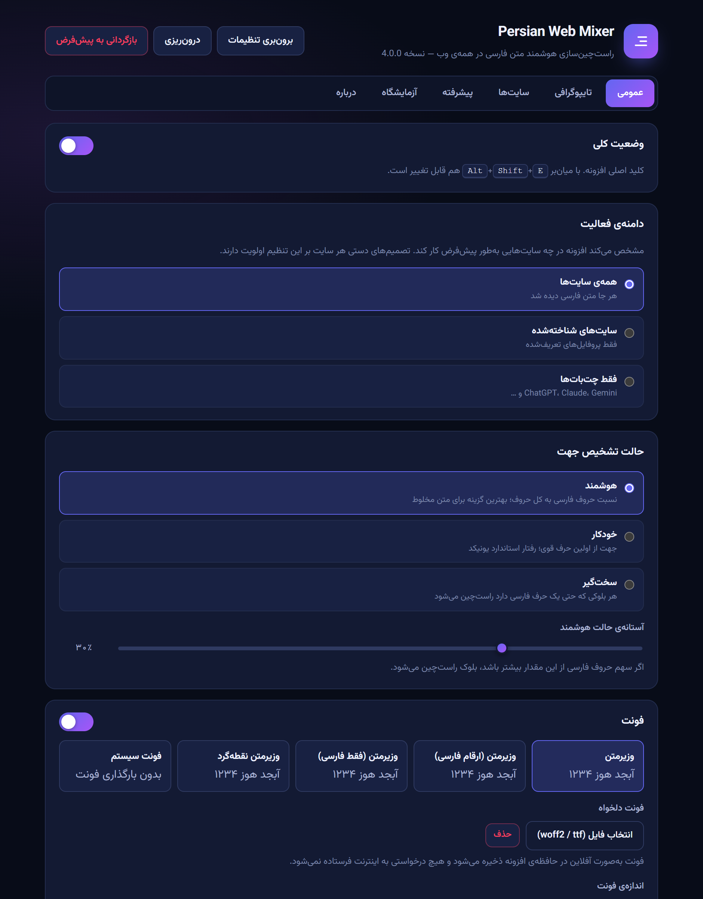

<div align="center">


# Persian Web Mixer

**Smart RTL for Persian & Arabic text — everywhere on the web.**

A Chromium extension that detects Persian/Arabic text on any page and right-aligns *only that text* — without breaking code blocks, math, icons, or the site's own layout.

[](manifest.json)
[](test/)
[](#privacy)
[](LICENSE)

<picture>
  <source media="(prefers-color-scheme: dark)" srcset="docs/hero-dark.png">
  
</picture>

</div>

---

## The problem

Most RTL browser extensions work like this: *if the text contains a Persian letter, right-align it.* That single rule produces four bugs you hit within a minute of real use:

| Input | Naive extension | What should happen |
|---|---|---|
| `The word سلام means hello in Persian` | flips the whole paragraph | stays LTR — it's an English sentence |
| `۱۲۳۴۵` | right-aligns it | digits are **neutral**, leave it alone |
| ```def sort(a): # مرتب‌سازی``` | mirrors your code | code is always LTR |
| A button labeled `ذخیره` | label jumps to one edge | direction yes, alignment no |

Persian Web Mixer counts **strong directional characters** per Unicode's bidi algorithm instead. Digits (Latin, Arabic-Indic, Persian), punctuation, emoji, and ZWNJ are neutral — they don't vote.

## Detection modes

| Mode | Rule | Use it when |
|---|---|---|
| **Smart** (default) | RTL letters ÷ all letters ≥ threshold (30%) | mixed Persian/English content — chat, docs, code reviews |
| **Auto** | direction of the first strong letter | you want standard Unicode behavior |
| **Strict** | any Persian letter ⇒ RTL | fully-Persian sites where you want zero misses |

The threshold is a slider, and the **Lab** tab in Settings shows you the engine's decision, the letter counts, the ratio, and a live preview for any text you paste.

<div align="center"></div>

---

## Install

**From source (current):**

1. Download or clone this repo.
2. Open `chrome://extensions` (or `edge://extensions`).
3. Turn on **Developer mode**.
4. Click **Load unpacked** and pick the project folder.

No build step. It's plain JavaScript and the fonts ship inside the extension.

Or grab the packed `.zip` from [Releases](../../releases) and drag it onto the extensions page.

---

## Features

### Site profiles — 27 of them

The extension knows what a "message bubble" is on each site, so it right-aligns the whole turn instead of a random inner `<span>`, and it knows which parts to never touch.

**AI chats:** ChatGPT · Claude · Gemini · Google AI Studio · DeepSeek · Grok · Perplexity · Microsoft Copilot · Le Chat · NotebookLM · Poe · Kimi · Qwen · Z.ai · OpenRouter

**Regular web:** GitHub · GitLab · Wikipedia · Stack Overflow · Reddit · YouTube · X/Twitter · Discord · Telegram Web · WhatsApp Web · Notion · Medium/Dev.to/Substack/Virgool

Unknown sites get a generic profile that still works — the extension isn't limited to this list.

### Shadow DOM, including closed roots

Angular Material, YouTube, and Reddit render inside Shadow DOM; some use `mode: 'closed'`, which is invisible to normal extensions. A `MAIN`-world hook at `document_start` opens them and reports new roots by event — no polling.

### Text inputs that just work

Inputs get `unicode-bidi: plaintext` + `dir="auto"`, so **the browser** decides direction per line. Type Persian, get RTL. Type English on the next line, get LTR. Zero JavaScript per keystroke.

### Typography controls

Line height, letter/word/paragraph spacing, justification, list indent, blockquote side, table mirroring — plus 4 bundled Vazirmatn variants (variable, Persian digits, Persian-only, round-dots), custom font upload, and 70–160% sizing.

<div align="center">
 &nbsp; 
</div>

### Per-site control

Toggle any domain on or off independently, or give it its own mode and font. Three scopes: all sites, known sites only, or AI chatbots only.

### Keyboard shortcuts

| Shortcut | Action |
|---|---|
| <kbd>Alt</kbd>+<kbd>Shift</kbd>+<kbd>R</kbd> | toggle current site |
| <kbd>Alt</kbd>+<kbd>Shift</kbd>+<kbd>E</kbd> | master switch |
| <kbd>Alt</kbd>+<kbd>Shift</kbd>+<kbd>P</kbd> | rescan page |

Remap them at `chrome://extensions/shortcuts`. There's a right-click menu too, and the toolbar icon greys out when the extension is off on the current site.

---

## Privacy

- **Zero network requests.** Fonts are bundled; nothing is fetched at runtime.
- **Nothing leaves your browser.** No telemetry, no analytics, no page content read out.
- **Site security is untouched.** No `declarativeNetRequest`, no header rewriting — see below for why that matters.
- The only storage is your own settings in `storage.local`.

Permissions requested: `storage`, `scripting`, `contextMenus`, and `<all_urls>` (needed because the extension has to read text on whichever page you're on).

---

## How it works

```
src/core/          pure logic — no chrome.*, no DOM at load; runs in every context and in Node tests
  bidi.js          direction detection by strong-character counting
  sites.js         27 site profiles: anchors, guards, input selectors
  settings.js      schema, validation, v3→v4 migration, per-domain effective config
  css.js           stylesheet generation + Constructable Stylesheet injection
src/content/
  engine.js        incremental DOM walk, marking, Shadow DOM management
  boot.js          startup, font loading, messaging
src/main-world/    attachShadow hook (MAIN world, document_start)
src/background/    service worker: badge, context menu, commands, tab injection
src/popup/         popup UI
src/options/       settings page (6 tabs + detection Lab)
```

### Four design decisions worth explaining

**1. Marking with a data attribute, not a CSS class.**
The engine sets `data-pwm-dir="rtl"` on a block. A class would collide with the site's own class names and survive incomplete cleanup; an attribute sweep (`querySelectorAll('[data-pwm-dir]')`) guarantees the page returns to exactly its original state when you toggle off.

**2. `text-align: start`, not `text-align: right`.**
With `start` plus `direction: inherit` on descendants, a Latin "island" inside a Persian paragraph aligns correctly on its own. Logical properties (`padding-inline-start`, `border-inline-start`) then mirror lists and blockquotes for free.

**3. Fonts via `FontFace` + `ArrayBuffer`, not `@font-face { src: url() }`.**
The font is read as bytes and added to `document.fonts`, which means the page's `font-src` CSP is irrelevant. Extensions that inject fonts by URL often **strip the site's `Content-Security-Policy` header** to make it work — a real security regression. This one never touches a response header, and the `declarativeNetRequest` permission is gone entirely. Bonus: fonts added to `document.fonts` are visible inside every Shadow Root.

**4. Incremental, time-sliced processing.**
Only the subtree of changed nodes is queued, work is split into `budgetMs` slices that yield to the event loop, and DOM reads are separated from writes to avoid layout thrashing. Scheduling deliberately avoids `requestIdleCallback` and `requestAnimationFrame` — both stall in hidden tabs and unfocused windows, which would freeze processing indefinitely.

Measured: 2000 paragraphs marked in ~550 ms, page still at full frame rate.

---

## Development

```bash
npm test              # 122 unit tests (pure logic + jsdom DOM tests)
npm run test:browser  # 88 integration tests in a real browser with the extension loaded
npm run pack          # → dist/persian-web-mixer-v4.0.0.zip
node tools/shots.js   # regenerate docs/*.png
```

`test/run.js` covers direction detection, domain matching, settings validation and clamping, CSS generation, DOM marking, Shadow DOM, full cleanup, and bundle integrity (fonts are valid WOFF2, icons are valid PNG, every profile selector compiles).

`test/browser.js` loads the actual extension and checks real behavior: visual alignment measured with a `Range` bounding box, font rendering measured via canvas text width, keyboard typing, streamed content, Shadow DOM (open/closed/nested), service-worker message round-trips, live settings changes, layout mirroring, and throughput on 2000 paragraphs.

> Requires `jsdom` and `puppeteer-core`. Point `NODE_PATH` at them if they're not in `node_modules`.
>
> **Chrome ≥ 137 began removing `--load-extension`, and by Chrome 150 the switch is inert** — puppeteer cannot load an unpacked extension in Chrome at all. The browser test therefore defaults to **Edge** (same Chromium engine). Override with `CHROME_PATH`.

---

## Version 3 → 4

Version 4 is a full rewrite. The old version was 988 lines; this one is ~3,900 in `src/`.

| | v3 | v4 |
|---|---|---|
| Detection | any Persian letter ⇒ RTL | strong-character counting, 3 modes + threshold |
| Persian digits alone | right-aligned (wrong) | neutral |
| DOM traversal | entire `document.body` on every mutation | only the changed subtree, time-sliced |
| Marking | `.rtl-processed` class | `data-pwm-dir` attribute |
| Alignment | `text-align:right` on all descendants | `text-align:start` + `direction:inherit` |
| UI controls | button alignment broke | `rtl-ui`: direction only |
| Fonts | `@font-face` with a data: URL | `FontFace` + `ArrayBuffer` |
| Site CSP | **stripped the header** | untouched; permission removed |
| Inputs | JS on every `input` event | `unicode-bidi:plaintext` |
| Shadow DOM | periodic scan of all elements | event from MAIN-world hook |
| Sites | 5 names listed in the popup (no logic) | 27 profiles with anchors and guards |
| Settings | 3 toggles | full page, per-domain, import/export |
| Tests | none | 122 unit + 88 browser |

---

## Credits

Bundled font: [Vazirmatn](https://github.com/rastikerdar/vazirmatn) by Saber Rastikerdar (SIL OFL 1.1).

Extension code: MIT — see [LICENSE](LICENSE).
